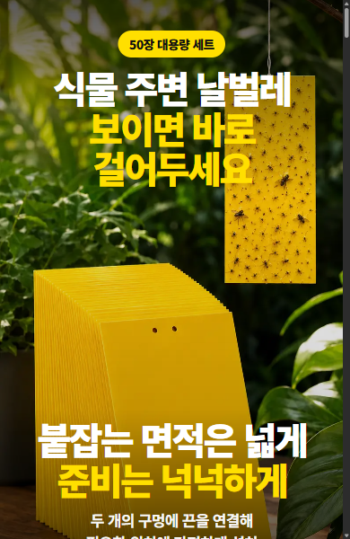

# Detail Page Maker Skill

공급처 URL 하나만 주면 제품 SSOT부터 경쟁사보다 강한 판매 기획, 이미지, GIF,
최종 Studio 수정, `output/detail-page.html`, 쿠팡 Wing CDN 출력까지 이어서 만드는
공개 Codex 스킬이다. 실행에 필요한 연관 스킬 14개는 이 스킬 폴더 안에 잠금된
상태로 포함된다.

## 제작 흐름

1. 공급처 URL을 받고 실제 제품 사진이 있는지만 한 번 묻는다. 사진이 없거나
   답이 없으면 공급처 동일 SKU를 SSOT로 삼아 계속한다.
2. 쿠팡에서 동일 SKU를 우선하고, 같은 카테고리 상위 판매상품까지 최소 3개를
   찾아 판매량·순위·후기 신호와 설명을 비교한다.
3. 가장 좋은 A 페이지를 전체 뼈대로 정하고 B·C의 더 좋은 설명·소구를 보강한다.
   섹션별 디자인 레퍼런스를 따로 고른 뒤 모든 카피를 현재 상품으로 다시 쓴다.
4. `BENCHMARK-ASSEMBLY.md`를 포함한 기획안을 보여 준다. 즉시 승인할 수 있고,
   명시적 반려가 없으면 120초 뒤 QA를 유지한 채 자동으로 제작을 계속한다.
5. God Tibo/ChatGPT Image 2 이미지와 HyperFrames 모션을 만들고 FFmpeg로
   GIF·animated WebP를 파생해 쿠팡 1초 전달형 상세페이지로 조립한다.
6. Studio는 중간 승인 화면으로 쓰지 않는다. G4 조립·사전 QA가 끝난 완성본에서만
   `Studio에서 최종 수정`으로 열고, 저장 뒤 commit·capture·QA·Wing 배포를 재개한다.

## 제작 예시

<table>
  <thead>
    <tr>
      <th align="center">노바페이스-깔창-상세페이지</th>
      <th align="center">해충-끈끈이-상세페이지</th>
    </tr>
  </thead>
  <tbody>
    <tr>
      <td align="center">
        <a href="https://csm-kr.github.io/detail-page-maker-skill/examples/%EB%85%B8%EB%B0%94%ED%8E%98%EC%9D%B4%EC%8A%A4-%EA%B9%94%EC%B0%BD-%EC%83%81%EC%84%B8%ED%8E%98%EC%9D%B4%EC%A7%80.html">
          
        </a>
      </td>
      <td align="center">
        <a href="https://csm-kr.github.io/detail-page-maker-skill/examples/%ED%95%B4%EC%B6%A9-%EB%81%88%EB%81%88%EC%9D%B4-%EC%83%81%EC%84%B8%ED%8E%98%EC%9D%B4%EC%A7%80.html">
          
        </a>
      </td>
    </tr>
    <tr>
      <td align="center"><a href="https://csm-kr.github.io/detail-page-maker-skill/examples/%EB%85%B8%EB%B0%94%ED%8E%98%EC%9D%B4%EC%8A%A4-%EA%B9%94%EC%B0%BD-%EC%83%81%EC%84%B8%ED%8E%98%EC%9D%B4%EC%A7%80.html"><strong>실제 HTML로 더 보기 →</strong></a></td>
      <td align="center"><a href="https://csm-kr.github.io/detail-page-maker-skill/examples/%ED%95%B4%EC%B6%A9-%EB%81%88%EB%81%88%EC%9D%B4-%EC%83%81%EC%84%B8%ED%8E%98%EC%9D%B4%EC%A7%80.html"><strong>실제 HTML로 더 보기 →</strong></a></td>
    </tr>
  </tbody>
</table>

## 설치

공개 저장소이므로 별도 GitHub 인증 없이 macOS, Ubuntu, Windows의 대상 프로젝트
폴더에서 아래 명령을 한 번 실행한다. `detail-page-maker-skill`과 내장 연관 스킬이
프로젝트 로컬에 함께 설치된다.

```sh
npx skills add https://github.com/csm-kr/detail-page-maker-skill --skill detail-page-maker-skill --agent codex --yes --copy
```

전역 설치는 하지 않는다. 설치 후 Codex에 다음처럼 요청하면 된다.

```text
$detail-page-maker-skill로 이 공급처 상품의 상세페이지를 만들어줘: <공급처 URL>
```

## 업데이트

```sh
npx skills update detail-page-maker-skill --project --yes
```

업데이트도 Git 원본의 단일 스킬 폴더를 다시 받는다. 내장된 연관 스킬은 별도로
설치하거나 업데이트하지 않는다.

## 실행 검사

Node.js 22.15.0 이상, Git, npm/npx가 필요하다. GIF 제작에는 `ffmpeg`가 필요하고, motion 작업 시
내장 HyperFrames 절차가 `npx hyperframes`로 프로젝트 로컬 런타임을 준비한다.
실제 브라우저 수집·검수에는 `browser-harness` 실행 파일이 필요하다. 이들은
별도 스킬이 아니라 세 운영체제에서 사용하는 실행 프로그램이다.

```sh
node .agents/skills/detail-page-maker-skill/scripts/detail-page.mjs doctor
node .agents/skills/detail-page-maker-skill/scripts/e2e.mjs
```

설치된 폴더 하나를 다른 프로젝트에 수동 복사하는 방식은 지원하지 않는다.
프로젝트마다 위 Git 설치 명령을 실행해 출처와 업데이트 경로를 유지한다.

## Windows 수동 검증

GitHub Actions는 사용하지 않는다. Windows 환경 담당자가 필요할 때 저장소
루트에서 아래 검증을 직접 실행한다.

```powershell
node tests/run-suite.mjs portable-skill
node tests/run-suite.mjs orchestration
node tests/run-suite.mjs studio-v1
node tests/remote-git-install.mjs
```

다른 운영체제의 추가 검증도 해당 환경 담당자가 같은 suite를 수동 실행한다.

## 저장 위치

- 사용자가 넣는 실제 제품 사진: `<project>/input/product/`
- 편집·복구 내부 상태: `<project>/.detail-page/`
- 최종 고객 HTML: `<project>/output/detail-page.html`
- 이미지·GIF: `<project>/output/media/`
- 새 프로젝트 기본 루트: `.workspace/projects/`

실행 중 수집·생성되는 공급처 원본, 이미지, GIF, 영상, QA 캡처와 프로젝트 상태는
Git 배포물에 포함하지 않는다. Git에는 단일 스킬, 증류된 규칙, 회귀 테스트와
README에서 공개하는 선별 예시만 둔다.

스킬 실행 계약은
[`skills/detail-page-maker-skill/SKILL.md`](skills/detail-page-maker-skill/SKILL.md)에
있다.
