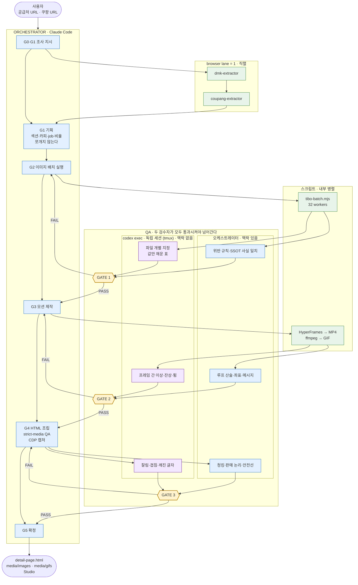

# Claude Code에서 실행

Codex가 아닌 호스트에서 이 스킬을 실행할 때 가장 먼저 읽는다. 제작 계약, 안전선,
품질 기준은 호스트와 무관하게 동일하다. 이 문서는 호스트 차이에서만 생기는 것을
다룬다.

## 스킬 파일 접근

`npx skills add --agent codex`는 `.agents/skills/`에 설치한다. Claude Code는 이
경로를 스킬로 자동 인식하지 않으므로 `/detail-page-maker-skill` 호출이 없다.
`SKILL.md`와 `references/*.md`를 직접 읽어 지침으로 삼고, 실행부는 `scripts/`의
CLI를 그대로 호출한다.

`agents/*.yaml`은 Codex UI에 스킬을 노출하기 위한 카탈로그 항목이다. 실행 로직이
없으므로 읽지 않아도 된다.

`doctor`의 `host_skills.hyperframes`는 호스트 설치본을 찾는다. Codex와 Claude Code
중 어느 쪽에 설치돼 있어도 되지만, 둘 다 없으면 여기서 멈추고 HyperFrames를 먼저
준비한다.

## 전체 흐름

오케스트레이터가 조사·기획·조립을 쥐고, 생성은 스크립트에 맡기고, 검수만
독립 세션으로 내보내는 구조다. 세로축이 시간이다.

```text
 사용자
   │  공급처 URL · 기준 쿠팡 URL · (선택) 실제 사진
   ▼
┌──────────────────────────────────────────────────────────────────┐
│  ORCHESTRATOR  (Claude Code · 단일 맥락 유지)                     │
└──────────────────────────────────────────────────────────────────┘
   │
   │ G0·G1  조사                     ┌─ browser lane = 1 (직렬 강제) ─┐
   ├───────────────────────────────► │  dmk-extractor    (공급처)     │
   │                                 │        ↓                       │
   │                                 │  coupang-extractor (기준작)    │
   │                                 └────────────────────────────────┘
   │                                          │
   │        Product Card + 기구 동작 제약 ◄───┤
   │        Coupang Flow Map              ◄───┘
   │
   │ G1  기획 — 오케스트레이터가 직접 (쪼개지 않음)
   │      섹션 순서 · 카피 청킹 · still job · GIF brief · 비율 배정
   │
   │ G2  이미지                       ┌────────────────────────────┐
   ├───────────────────────────────► │ tibo-batch.mjs  32 workers │
   │                                 │ (비율별로 job 분리)         │
   │                                 └────────────────────────────┘
   │                                          │
   │                                          ▼
   │                       ╔══════════════════════════════════════╗
   │  재생성 필요 ◄─ FAIL ─╢  GATE 1                              ║ ← 가장 값싼 지점
   │  (G2로 복귀)          ║  codex : 파일 개별 지정 → 값만 채운 표 ║
   │                       ║  본인   : 위반 규칙 · SSOT 사실 일치   ║
   │                       ╚═══════════════════╤══════════════════╝
   │                                        PASS (둘 다)
   │ G3  모션                        ┌───────────────────────────┐
   ├───────────────────────────────► │ HyperFrames → MP4         │
   │                                 │ ffmpeg palette → GIF      │
   │                                 └───────────────────────────┘
   │                                          │
   │                                          ▼
   │                       ╔══════════════════════════════════════╗
   │  컴포지션 수정 ◄ FAIL ─╢  GATE 2                              ║
   │  (G3로 복귀)          ║  codex : 프레임 간 이상 · 잔상 · 튐    ║
   │                       ║  본인   : 루프 산술 · 좌표 · 메시지    ║
   │                       ╚═══════════════════╤══════════════════╝
   │                                        PASS (둘 다)
   │ G4  조립 — 780px HTML (오케스트레이터가 직접)
   │        + qa --strict-media
   │        + CDP 슬라이스 캡처
   │                                          │
   │                                          ▼
   │                       ╔══════════════════════════════════════╗
   │  카피·CSS 수정 ◄ FAIL ─╢  GATE 3                              ║
   │  (G4로 복귀)          ║  codex : 잘림 · 겹침 · 깨진 글자       ║
   │                       ║  본인   : 청킹 · 판매 논리 · 안전선    ║
   │                       ╚═══════════════════╤══════════════════╝
   │                                        PASS (둘 다)
   │ G5  확정
   ▼
 output/detail-page.html · media/{images,gifs}/ · Studio · (선택) Wing
```

각 gate는 **두 검수자가 모두 통과시켜야 넘어간다.** codex 패널이 도는 동안
오케스트레이터가 자기 몫의 검수를 병렬로 수행하고, 끝나면 두 결과를 합친다.
codex 결과는 파일별 PASS/FAIL로 받아 기계적으로 집계한다.



핵심은 **FAIL 화살표가 항상 바로 앞 생산 단계로만 돌아간다**는 점이다. gate를
마지막에 하나만 두면 gate 3의 FAIL이 G2까지 거슬러 올라가 GIF와 HTML을 통째로 다시
만들게 된다.

## 역할 배분

`SKILL.md`는 Evidence, Flow, Planning, Production, QA를 병렬 위임하고 **한 생산자가
자기 결과의 유일한 검수자가 되지 않을 것**을 요구한다. 단일 컨텍스트에서 전부
처리하면 이 조항이 깨지고, 제작자가 자기 프롬프트 의도를 알기 때문에 어긋난 컷을
그냥 통과시킨다.

병렬화 예산을 어디에 쓸지가 핵심이다. 조사·생성 단계는 이미 병목이 아니다.
URL 캡처는 브라우저 lane이 1이라 어차피 직렬이고, 이미지 생성은 `tibo-batch.mjs`가
내부에서 32 worker로 돌린다. 여기에 agent를 덧씌워도 인계 비용만 늘고 벽시계는
줄지 않는다. **예산은 전부 독립 QA에 쓴다.**

| 역할 | 실행 주체 | 근거 |
| --- | --- | --- |
| Evidence — 공급처 SSOT | 오케스트레이터 인라인 | 브라우저 lane 1로 직렬이 강제된다 |
| Flow — 쿠팡 Flow Map | 오케스트레이터 인라인 | 위와 같다. 캡처 두 건 합쳐 수 분이다 |
| Planning — Page Plan, 카피, 프롬프트·모션 설계 | 오케스트레이터 | 섹션 순서·줄바꿈·미디어 배정이 한 맥락에서 나와야 일관된다 |
| Production — 이미지 배치, 모션 렌더 | 스크립트 직접 실행 | 이미 내부 병렬이다 |
| **QA — 3개 gate** | **codex + 오케스트레이터 둘 다** | 아래 |

조사나 기획을 여러 agent로 쪼개고 싶다면 그렇게 해도 되지만, QA 분리를 먼저 확보한
뒤에 남는 여유로 한다. 순서를 바꾸면 얻는 게 없다.

### QA를 gate로 나눈다

생산 단계가 끝난 뒤 한 번에 검수하면, 초기 단계의 잘못된 컷 위에 GIF와 HTML이
쌓인 뒤에야 발견돼 재작업이 뒤로 전파된다. 각 단계 **직후**에 끊는다.

| gate | 시점 | 검수 대상 |
| --- | --- | --- |
| 1 | 이미지 배치 직후 | 제품 identity, **기구 동작 제약**, 로고·각인의 위치와 회전, 동일 구도 쌍의 프레임 일치 |
| 2 | GIF 파생 직후 | 루프 이음매, 혼합 프레임, 오버레이 좌표, 첫 프레임 가독성 |
| 3 | HTML 조립 직후 | 780px 캡처의 줄바꿈, 정렬, 밀도, 잘림, 카피와 이미지의 일치 |

gate 1이 가장 값싸다. 여기서 막으면 GIF와 HTML 재작업이 0이 된다.

### 두 검수자를 모두 돌린다

QA를 codex에만 맡기지 않는다. 두 검수자가 보는 것이 다르고, 서로가 못 보는 것을
덮는다. **양쪽이 모두 통과시켜야 다음 단계로 넘어간다.**

| | codex exec | 오케스트레이터 |
| --- | --- | --- |
| 상태 | 제작 맥락 없음 | 제작 맥락 있음 |
| 강점 | 의도를 모르므로 "실제로 보이는 것"을 그대로 말한다 | 무엇을 주장하려 했는지 알아 카피와 근거를 대조할 수 있다 |
| 약점 | 무엇이 틀렸는지 판단할 기준이 없다 | 자기가 의도한 것을 보기 때문에 어긋난 컷을 통과시킨다 |
| 맡길 것 | 사람·사물 수, 색, 부품 방향과 결합, 글자의 방향과 회전, 프레임 간 튐과 잔상, 잘림·겹침·깨진 글자 | 위반 판정, SSOT 사실 일치, 루프 산술, 카피 청킹, 판매 논리, 스킬 안전선 |

codex에는 **제작 프롬프트를 주지 않는다.** 산출물 경로, Product Card의 identity와
기구 동작 제약, 판정 기준만 넘긴다. "이 장면은 롱노즐이 수평이어야 한다"처럼
정답을 알려주면 독립성이 사라지므로, **보이는 것을 서술하게 하고 기대값 대조는
오케스트레이터가 한다.**

오케스트레이터 몫은 codex 패널이 도는 동안 병렬로 처리한다. 자기 검수를 생략하고
codex 결과만 보고 넘어가면 카피·사실·논리 오류가 그대로 통과한다.

`node scripts/detail-page.mjs agent-capacity`로 권장 워커 수를 확인한다.

## Gate 1 — 이미지 판독

가장 값싼 gate이자 실제로 가장 자주 새는 gate다. 아래는 모두 실측이다.

### 파일을 하나씩 지정한다

**이미지 디렉터리를 통째로 넘기지 않는다.** 폴더를 가리키면 codex가 PNG를 텍스트로
열어 base64를 수백 KB 쏟아내고 판독은 하지 못한 채 끝난다.

프롬프트에 **절대경로를 한 줄에 하나씩** 나열한다. 배치를 쪼갤 필요는 없다.
28장을 한 exec에 넣어도 28줄이 모두 돌아온다.

| 장수 | 토큰 |
| --- | --- |
| 1 | 약 9,000 |
| 4 | 11,400 |
| 28 | 51,600 |

고정비가 크고 장당 한계비용은 1.5k 안팎이다. 여러 번 부르는 쪽이 오히려 비싸다.

파일명을 보고 지어내는 것이 아니라 실제로 픽셀을 읽는다. 같은 4장을 `a.png`~`d.png`로
섞어 이름을 지운 대조 실험에서도 4/4 정답이었다. 다만 파일명이 답을 암시하면
검증력이 떨어지므로, 결과가 미심쩍을 때는 중립 이름으로 복사해 다시 묻는다.

### 질문 설계가 gate의 전부다

**질문에 없는 항목은 절대 걸리지 않는다.** 이것이 gate 1이 새는 유일한 경로다.

실패 사례: 부품 수·색·손 개수만 물어 28장을 전부 PASS시켰다. 글자 방향을 묻지
않았기 때문에, 로고가 90° 틀어진 컷 3장이 그대로 통과해 사용자가 발견했다.
같은 이미지에 **열 하나만 추가**하자 3장이 즉시 걸렸다.

그러므로 identity lock을 **셀 수 있는 값으로 기계 변환**한다. lock 문장 하나마다
최소 한 열을 만든다. 서술형으로 받으면 집계도 안 되고 누락도 안 보인다.

| lock 문장 | 검증 열 |
| --- | --- |
| 파란 패드는 밑면 뒤꿈치에 **평평하게** 박혀 있다 | `blue-oval=<yes\|no>` + 면을 함께 물어 교차 검증 |
| 윗면은 패드 없는 **민무늬** 메쉬다 | `face=<bottom\|top\|edge\|unclear>` |
| 로고와 각인은 **길이 방향**으로 읽힌다 | `axis=<horizontal\|vertical\|diagonal\|none>` · `ovaltext=<reads-horizontal\|reads-vertical\|none>` · `embossedtext=<...>` |
| 손은 정상적인 다섯 손가락 한 쌍이다 | `hands=<수>` |
| 좌우 한 켤레다 | `insoles=<수>` |

판정은 codex에게 맡기지 않는다. **codex는 보이는 값만 채우고, 위반 판정은
오케스트레이터가 규칙으로 돌린다.** 위 예에서는 `axis=vertical`인데
`ovaltext=reads-horizontal`이면 위반, 그리고 `ovaltext`와 `embossedtext`가
서로 다르면 같은 부품 위의 두 글자가 어긋난 것이므로 위반이다. 이 두 줄짜리
규칙이 사람 눈보다 먼저 3장을 집어냈다.

`axis=diagonal`처럼 규칙으로 못 가르는 값은 오케스트레이터가 직접 본다.
gate는 **눈으로 볼 대상을 좁혀 주는 장치**이지 눈을 대신하는 장치가 아니다.

### 프롬프트 형태

```text
Read every one of these N image files and report only what you can actually see in each.

C:\proj\output\media\images\01-hero.png
...

For each file output exactly one line, and nothing else:

<filename> | axis=<horizontal|vertical|diagonal|none> | ovaltext=<reads-horizontal|reads-vertical|none>

Do not open any other file. Do not explain. Output exactly N lines.
```

- 열 이름에 하이픈을 넣지 않는다. 값과 섞여 파싱이 흔들린다.
- `reads-vertical`이 무슨 뜻인지 한 문장으로 정의해 준다. "고개를 기울이지 않고
  왼쪽에서 오른쪽으로 읽을 수 있으면 horizontal"처럼 관찰 절차로 쓴다.
- **기대값을 적지 않는다.** "이 컷은 로고가 세로여야 한다"고 알려주면 독립성이
  사라진다. 무엇이 보이는지만 묻는다.
- `Do not explain`과 `exactly N lines`가 없으면 서술이 섞여 집계가 깨진다.

### 회전·반전은 크롭해서 확인한다

세로 컷의 글자 방향은 전체 이미지를 눈으로 훑어서는 판단이 어긋난다. 실제로
정상인 컷을 반전으로 오독했다. `ffmpeg`로 잘라 돌려 놓고 본다.

```bash
ffmpeg -i shot.png -vf "crop=W:H:X:Y,transpose=1,scale=iw*3:ih*3" crop.png
```

`transpose=1`이 시계 방향이다. 읽히는 방향이 나올 때까지 `1`과 `2`를 바꿔 보고,
**같은 회전을 적용했을 때 레퍼런스 사진과 같은 배치가 나오는지**로 판정한다.
페이지 전체가 같은 규약을 따르는지도 이 방법으로 확인한다.

### 재생성이 새 결함을 만든다

교정 프롬프트는 지적된 항목만 고치고 다른 곳을 망가뜨린다. 로고 회전을 강제하자
같은 컷의 각인이 좌우 반전으로 돌아왔다.

- 교정본은 **원본과 같은 gate를 다시 통과시킨다.** 고친 항목만 보지 않는다.
- 성공한 컷을 `work/ref/`에 넣어 다음 교정의 레퍼런스로 체인한다. 말로 설명하는
  것보다 정확하다.
- 작은 글자가 계속 깨지면 **빼는 선택지**를 프롬프트에 명시적으로 준다.
  "이 크기에서 깨끗하게 못 그리겠으면 아예 각인하지 말라"가 반전된 글자보다 낫다.
- 한 컷을 여러 안으로 동시에 뽑아 고르는 편이 순차 재시도보다 싸다.

## codex 세션 띄우기

macOS·Linux에서는 tmux 패널에서 `codex exec`를 바로 부르면 된다.

Windows에서는 WSL의 tmux가 Windows의 codex를 부르는 형태가 된다. 아래 네 가지를
지키지 않으면 조용히 멈추거나 즉시 죽는다.

- WSL 안에서 `codex`를 직접 실행하지 않는다. npm 셸 스크립트가 node를 찾지 못해
  `exec: node: not found`로 끝난다. `cmd.exe`를 통해 Windows codex를 부른다.
- 프롬프트를 bash → tmux → cmd로 중첩 인용하지 않는다. 세 겹에서 깨진다.
  프롬프트를 `.cmd` 배치 파일에 넣고 tmux는 그 파일만 실행한다.
- `cmd.exe`에 `/mnt/c/...`를 넘기지 않는다. `wslpath -w`로 변환한다.
- `< nul`로 stdin을 닫는다. tmux 안에서는 tty 판정이 달라져 codex가
  `Reading additional input from stdin...`에서 무한 대기한다.

배치 파일:

```bat
@echo off
cd /d "%~dp0"
codex exec --skip-git-repo-check "<프롬프트>" < nul > out.log 2>&1
echo EXIT=%ERRORLEVEL% >> out.log
```

실행과 회수:

```bash
WIN=$(wslpath -w "$DIR/run.cmd")
tmux new-session -d -s qa -x 200 -y 50 "cmd.exe /c \"$WIN\""
tmux set-option -t qa remain-on-exit on   # 죽은 패널의 출력을 남긴다
until [ "$(tmux list-panes -t qa -F '#{pane_dead}' | head -1)" = "1" ]; do sleep 4; done
cat "$DIR/out.log"
```

패널을 여러 개 띄울 때는 배치 파일과 로그를 역할별로 나눈다. `codex exec`는
사용자의 Codex 사용량을 소모하므로, 여러 패널로 확장하기 전에 사용자에게 알린다.

로그는 배치 파일이 `cd`한 디렉터리에 생긴다. 공개 출력 폴더에서 실행하면 로그가
`output/` 안에 남으므로, 작업 폴더에서 실행하거나 끝에서 옮긴다.

## Windows 실행 함정

- PowerShell의 `Set-Content -Encoding utf8`과 `Out-File`은 BOM을 붙인다. job JSON에
  붙으면 `JSON.parse`가 `Unexpected token ''`로 실패한다. BOM 없이 저장한다.
- 저장소를 clone할 때 번들 스킬의 `node_modules` 경로가 길어
  `Filename too long`이 난다. `git -c core.longpaths=true`를 쓰거나 `.agents/`를
  sparse-checkout에서 제외한다.
- 스킬 테스트는 `python3`를 호출한다. Windows에 `python`만 있으면 exit 9009로
  실패하며, 이는 환경 문제이지 변경 사항의 회귀가 아니다.

## 검수 루프

생성물을 파일 목록이나 종료 코드로 통과시키지 않는다. 반드시 눈으로 본다.

- 이미지: 생성 직후 열어 제품 identity와 기구 동작 제약을 대조한다. 여러 장은
  `ffmpeg ... tile=` 로 한 장에 붙여 한 번에 본다.
- GIF: 첫 프레임, 중간, 마지막 프레임을 뽑아 루프 이음매와 혼합 프레임을 확인한다.
  `select='eq(n\,0)+eq(n\,N)'` 로 특정 프레임만 추출한다.
- 전후 비교 쌍: 두 장을 위아래로 붙여 고정 요소가 같은 자리인지 확인한다.
- 완성 페이지: headless Chrome을 CDP로 붙여 `Page.captureScreenshot`에
  `captureBeyondViewport`와 `clip`을 주고 구간별로 잘라 캡처한다. 상세페이지는
  높이가 4만 픽셀을 넘어 한 번에 담기지 않는다.
- 캡처에서 확인할 것은 `references/studio.md`의 HTML QA 목록과 같다.

## 완료 전

- `node scripts/detail-page.mjs qa --project <folder> --strict-media`가 통과한다.
- 780px 캡처를 실제로 훑어 줄바꿈, 정렬, 밀도, 잘림을 확인했다.
- 제작 중 내린 우회 판단을 사용자에게 보고했다. 호스트 제약으로 스킬이 요구한
  절차를 생략했다면 무엇을 생략했고 무엇이 대체됐는지 명시한다.
