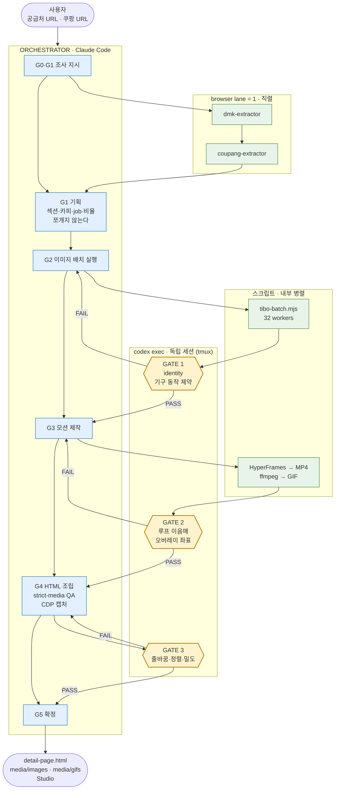

# Claude Code에서 실행

Codex가 아닌 호스트에서 이 스킬을 실행할 때 가장 먼저 읽는다. 제작 계약, 안전선,
품질 기준은 호스트와 무관하게 동일하다. 이 문서는 호스트 차이에서만 생기는 것을
다룬다.

## 스킬 파일 접근

`npx skills add --agent codex`는 `.agents/skills/`에 설치한다. Claude Code는 이
경로를 스킬로 자동 인식하지 않으므로 `/detail-page-maker-skill` 호출이 없다.
`SKILL.md`와 `references/*.md`를 직접 읽어 지침으로 삼고, 실행부는 `scripts/`의
CLI를 그대로 호출한다.

`agents/*.yaml`은 Codex UI에 스킬을 노출하기 위한 카탈로그 항목이다. 실행 로직이
없으므로 읽지 않아도 된다.

`doctor`의 `host_skills.hyperframes`는 호스트 설치본을 찾는다. Codex와 Claude Code
중 어느 쪽에 설치돼 있어도 되지만, 둘 다 없으면 여기서 멈추고 HyperFrames를 먼저
준비한다.

## 전체 흐름

오케스트레이터가 조사·기획·조립을 쥐고, 생성은 스크립트에 맡기고, 검수만
독립 세션으로 내보내는 구조다. 세로축이 시간이다.

```text
 사용자
   │  공급처 URL · 기준 쿠팡 URL · (선택) 실제 사진
   ▼
┌──────────────────────────────────────────────────────────────────┐
│  ORCHESTRATOR  (Claude Code · 단일 맥락 유지)                     │
└──────────────────────────────────────────────────────────────────┘
   │
   │ G0·G1  조사                     ┌─ browser lane = 1 (직렬 강제) ─┐
   ├───────────────────────────────► │  dmk-extractor    (공급처)     │
   │                                 │        ↓                       │
   │                                 │  coupang-extractor (기준작)    │
   │                                 └────────────────────────────────┘
   │                                          │
   │        Product Card + 기구 동작 제약 ◄───┤
   │        Coupang Flow Map              ◄───┘
   │
   │ G1  기획 — 오케스트레이터가 직접 (쪼개지 않음)
   │      섹션 순서 · 카피 청킹 · still job · GIF brief · 비율 배정
   │
   │ G2  이미지                       ┌────────────────────────────┐
   ├───────────────────────────────► │ tibo-batch.mjs  32 workers │
   │                                 │ (비율별로 job 분리)         │
   │                                 └────────────────────────────┘
   │                                          │
   │                                          ▼
   │                              ╔═══════════════════════╗
   │  재생성 필요 시 ◄─── FAIL ────╢  GATE 1   codex exec  ║  ← 가장 값싼 지점
   │  (G2로 복귀)                  ║  identity · 기구 제약  ║
   │                              ╚═══════════╤═══════════╝
   │                                       PASS
   │ G3  모션                        ┌───────────────────────────┐
   ├───────────────────────────────► │ HyperFrames → MP4         │
   │                                 │ ffmpeg palette → GIF      │
   │                                 └───────────────────────────┘
   │                                          │
   │                                          ▼
   │                              ╔═══════════════════════╗
   │  컴포지션 수정 ◄──── FAIL ────╢  GATE 2   codex exec  ║
   │  (G3로 복귀)                  ║  루프 이음매 · 좌표    ║
   │                              ╚═══════════╤═══════════╝
   │                                       PASS
   │ G4  조립 — 780px HTML (오케스트레이터가 직접)
   │        + qa --strict-media
   │        + CDP 슬라이스 캡처
   │                                          │
   │                                          ▼
   │                              ╔═══════════════════════╗
   │  카피·CSS 수정 ◄──── FAIL ────╢  GATE 3   codex exec  ║
   │  (G4로 복귀)                  ║  줄바꿈 · 정렬 · 밀도  ║
   │                              ╚═══════════╤═══════════╝
   │                                       PASS
   │ G5  확정
   ▼
 output/detail-page.html · media/{images,gifs}/ · Studio · (선택) Wing
```

각 gate는 tmux 패널 하나다. 오케스트레이터는 gate가 도는 동안 다음 단계의 준비
작업을 이어서 한다. gate 결과는 파일별 PASS/FAIL로 받아 기계적으로 집계한다.



핵심은 **FAIL 화살표가 항상 바로 앞 생산 단계로만 돌아간다**는 점이다. gate를
마지막에 하나만 두면 gate 3의 FAIL이 G2까지 거슬러 올라가 GIF와 HTML을 통째로 다시
만들게 된다.

## 역할 배분

`SKILL.md`는 Evidence, Flow, Planning, Production, QA를 병렬 위임하고 **한 생산자가
자기 결과의 유일한 검수자가 되지 않을 것**을 요구한다. 단일 컨텍스트에서 전부
처리하면 이 조항이 깨지고, 제작자가 자기 프롬프트 의도를 알기 때문에 어긋난 컷을
그냥 통과시킨다.

병렬화 예산을 어디에 쓸지가 핵심이다. 조사·생성 단계는 이미 병목이 아니다.
URL 캡처는 브라우저 lane이 1이라 어차피 직렬이고, 이미지 생성은 `tibo-batch.mjs`가
내부에서 32 worker로 돌린다. 여기에 agent를 덧씌워도 인계 비용만 늘고 벽시계는
줄지 않는다. **예산은 전부 독립 QA에 쓴다.**

| 역할 | 실행 주체 | 근거 |
| --- | --- | --- |
| Evidence — 공급처 SSOT | 오케스트레이터 인라인 | 브라우저 lane 1로 직렬이 강제된다 |
| Flow — 쿠팡 Flow Map | 오케스트레이터 인라인 | 위와 같다. 캡처 두 건 합쳐 수 분이다 |
| Planning — Page Plan, 카피, 프롬프트·모션 설계 | 오케스트레이터 | 섹션 순서·줄바꿈·미디어 배정이 한 맥락에서 나와야 일관된다 |
| Production — 이미지 배치, 모션 렌더 | 스크립트 직접 실행 | 이미 내부 병렬이다 |
| **QA — 3개 gate** | **codex exec 독립 세션** | 아래 |

조사나 기획을 여러 agent로 쪼개고 싶다면 그렇게 해도 되지만, QA 분리를 먼저 확보한
뒤에 남는 여유로 한다. 순서를 바꾸면 얻는 게 없다.

### QA를 gate로 나눈다

생산 단계가 끝난 뒤 한 번에 검수하면, 초기 단계의 잘못된 컷 위에 GIF와 HTML이
쌓인 뒤에야 발견돼 재작업이 뒤로 전파된다. 각 단계 **직후**에 끊는다.

| gate | 시점 | 검수 대상 |
| --- | --- | --- |
| 1 | 이미지 배치 직후 | 제품 identity, **기구 동작 제약**, 동일 구도 쌍의 프레임 일치 |
| 2 | GIF 파생 직후 | 루프 이음매, 혼합 프레임, 오버레이 좌표, 첫 프레임 가독성 |
| 3 | HTML 조립 직후 | 780px 캡처의 줄바꿈, 정렬, 밀도, 잘림, 카피와 이미지의 일치 |

gate 1이 가장 값싸다. 여기서 막으면 GIF와 HTML 재작업이 0이 된다.

### QA 세션에 무엇을 주는가

제작 프롬프트를 주지 않는다. **완성 산출물의 경로, Product Card의 identity와 기구
동작 제약, 판정 기준만** 넘긴다. 무엇을 의도했는지 모르는 상태로 보게 하는 것이
목적이다. 제작자는 자기가 의도한 것을 보기 때문에 어긋난 컷을 통과시킨다.

`codex exec`는 이미지 파일을 실제로 판독한다. 검증 결과 단일 이미지에 대해
사람 수, 색상, 부품의 방향까지 정확히 답했고 약 9천 토큰을 썼다. 판정은 서술형으로
받지 말고 **파일별 PASS/FAIL과 사유 한 줄**로 받아 기계적으로 집계한다.

`node scripts/detail-page.mjs agent-capacity`로 권장 워커 수를 확인한다.

## codex 세션 띄우기

macOS·Linux에서는 tmux 패널에서 `codex exec`를 바로 부르면 된다.

Windows에서는 WSL의 tmux가 Windows의 codex를 부르는 형태가 된다. 아래 네 가지를
지키지 않으면 조용히 멈추거나 즉시 죽는다.

- WSL 안에서 `codex`를 직접 실행하지 않는다. npm 셸 스크립트가 node를 찾지 못해
  `exec: node: not found`로 끝난다. `cmd.exe`를 통해 Windows codex를 부른다.
- 프롬프트를 bash → tmux → cmd로 중첩 인용하지 않는다. 세 겹에서 깨진다.
  프롬프트를 `.cmd` 배치 파일에 넣고 tmux는 그 파일만 실행한다.
- `cmd.exe`에 `/mnt/c/...`를 넘기지 않는다. `wslpath -w`로 변환한다.
- `< nul`로 stdin을 닫는다. tmux 안에서는 tty 판정이 달라져 codex가
  `Reading additional input from stdin...`에서 무한 대기한다.

배치 파일:

```bat
@echo off
cd /d "%~dp0"
codex exec --skip-git-repo-check "<프롬프트>" < nul > out.log 2>&1
echo EXIT=%ERRORLEVEL% >> out.log
```

실행과 회수:

```bash
WIN=$(wslpath -w "$DIR/run.cmd")
tmux new-session -d -s qa -x 200 -y 50 "cmd.exe /c \"$WIN\""
tmux set-option -t qa remain-on-exit on   # 죽은 패널의 출력을 남긴다
until [ "$(tmux list-panes -t qa -F '#{pane_dead}' | head -1)" = "1" ]; do sleep 4; done
cat "$DIR/out.log"
```

패널을 여러 개 띄울 때는 배치 파일과 로그를 역할별로 나눈다. `codex exec`는
사용자의 Codex 사용량을 소모하므로, 여러 패널로 확장하기 전에 사용자에게 알린다.

로그는 배치 파일이 `cd`한 디렉터리에 생긴다. 공개 출력 폴더에서 실행하면 로그가
`output/` 안에 남으므로, 작업 폴더에서 실행하거나 끝에서 옮긴다.

## Windows 실행 함정

- PowerShell의 `Set-Content -Encoding utf8`과 `Out-File`은 BOM을 붙인다. job JSON에
  붙으면 `JSON.parse`가 `Unexpected token ''`로 실패한다. BOM 없이 저장한다.
- 저장소를 clone할 때 번들 스킬의 `node_modules` 경로가 길어
  `Filename too long`이 난다. `git -c core.longpaths=true`를 쓰거나 `.agents/`를
  sparse-checkout에서 제외한다.
- 스킬 테스트는 `python3`를 호출한다. Windows에 `python`만 있으면 exit 9009로
  실패하며, 이는 환경 문제이지 변경 사항의 회귀가 아니다.

## 검수 루프

생성물을 파일 목록이나 종료 코드로 통과시키지 않는다. 반드시 눈으로 본다.

- 이미지: 생성 직후 열어 제품 identity와 기구 동작 제약을 대조한다. 여러 장은
  `ffmpeg ... tile=` 로 한 장에 붙여 한 번에 본다.
- GIF: 첫 프레임, 중간, 마지막 프레임을 뽑아 루프 이음매와 혼합 프레임을 확인한다.
  `select='eq(n\,0)+eq(n\,N)'` 로 특정 프레임만 추출한다.
- 전후 비교 쌍: 두 장을 위아래로 붙여 고정 요소가 같은 자리인지 확인한다.
- 완성 페이지: headless Chrome을 CDP로 붙여 `Page.captureScreenshot`에
  `captureBeyondViewport`와 `clip`을 주고 구간별로 잘라 캡처한다. 상세페이지는
  높이가 4만 픽셀을 넘어 한 번에 담기지 않는다.
- 캡처에서 확인할 것은 `references/studio.md`의 HTML QA 목록과 같다.

## 완료 전

- `node scripts/detail-page.mjs qa --project <folder> --strict-media`가 통과한다.
- 780px 캡처를 실제로 훑어 줄바꿈, 정렬, 밀도, 잘림을 확인했다.
- 제작 중 내린 우회 판단을 사용자에게 보고했다. 호스트 제약으로 스킬이 요구한
  절차를 생략했다면 무엇을 생략했고 무엇이 대체됐는지 명시한다.
